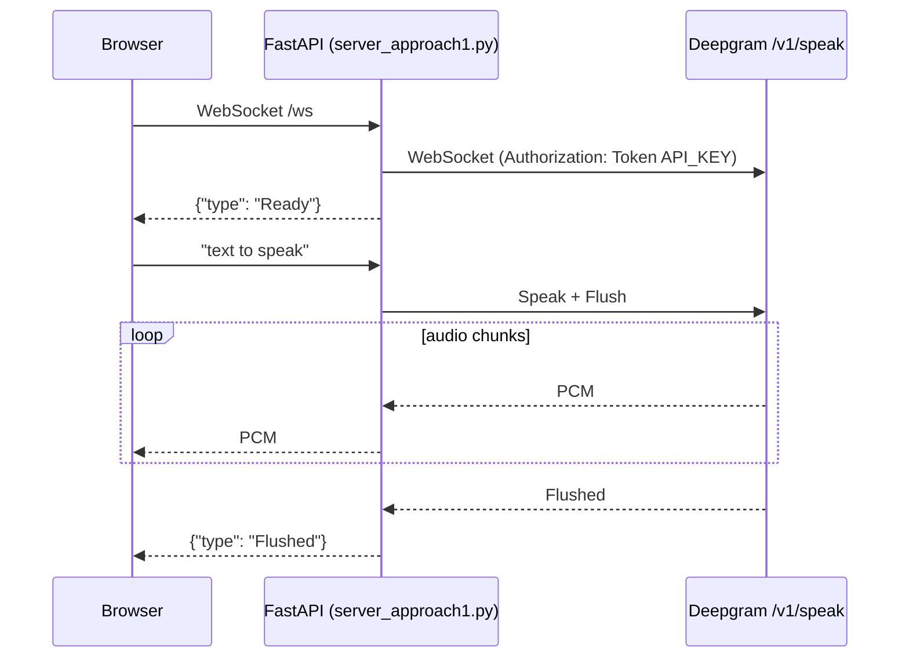
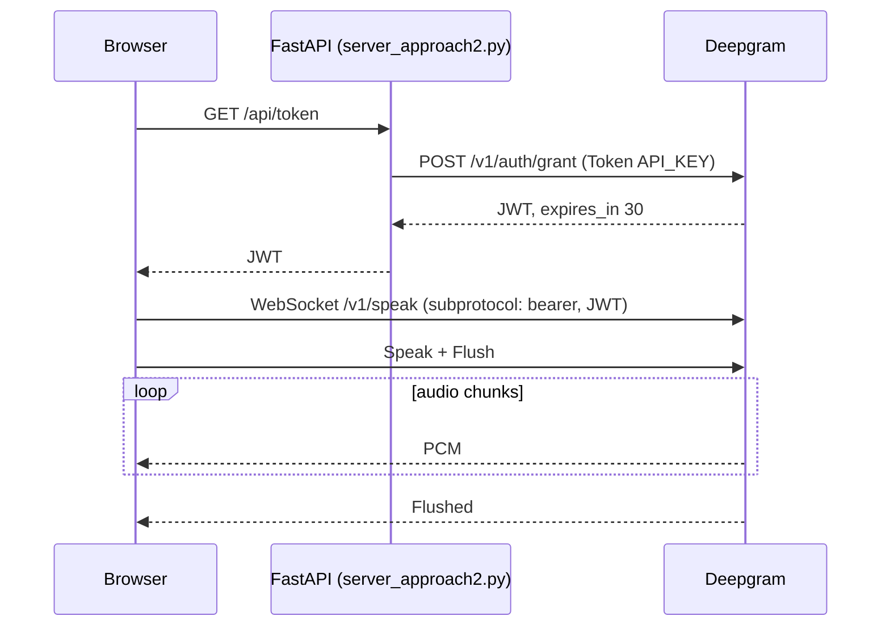

# deepgram-tts

Two ways to stream Deepgram text-to-speech into a browser, through your own server or straight from Deepgram with a short-lived token, plus a benchmark of what each costs in latency.

Both use FastAPI on the server, Deepgram's Speak WebSocket API, Aura-2 voices and linear16 PCM at 24 kHz.

## The two architectures

### A. Server proxy

The browser talks only to your server. The server holds the API key, opens its own WebSocket to Deepgram and relays every audio chunk.



### B. Direct connection with a short-lived token

Your server only mints tokens. It exchanges the long-lived API key for a JWT through Deepgram's [`/v1/auth/grant`](https://developers.deepgram.com/guides/fundamentals/token-based-authentication) (30 second TTL by default) and the browser opens its own WebSocket to Deepgram. Audio never touches your server.



The token only has to be valid when the WebSocket opens. An open connection keeps working after it expires.

There are two pages for this path: `index_approach2.html` plays chunks as they arrive with Web Audio, and `index_approach2_wav.html` buffers the whole utterance into a WAV blob and plays it with an `<audio>` element (simpler, but nothing plays until the last byte arrives).

## Results

Measured on 2026-10-05, 02:36 to 02:59 UTC, with `bench/ttfa.py`: 20 runs per path per text, proxy and direct runs interleaved in random order, one warm-up run per path discarded. Raw data: [`bench/results/2026-10-05.json`](bench/results/2026-10-05.json).

- **Where:** a MacBook (M3 Pro) on a home connection in Gilgit, Pakistan (ISP: SCO, AS18053). Both FastAPI servers ran on the same laptop as the client.
- **Deepgram:** `api.deepgram.com`, model `aura-2-thalia-en`, linear16, 24 kHz. DNS handed out 8 different addresses across runs (DNS names seen included `sac1`, `va1` and `md1`, so more than one Deepgram site). Ping round trips to them were about 230 to 310 ms from here.
- **Client:** Python 3.12 with `websockets` 15. It measures bytes on the wire, not browser playback.

All times are in milliseconds, shown as p50 / p95. With 20 samples, p95 is roughly the second-worst run.

**Time to first audio byte after sending text, with the connection already open**

| Text | Chars | Proxy | Direct |
|---|---:|---:|---:|
| short | 58 | 348 / 406 | 342 / 680 |
| medium | 223 | 342 / 403 | 341 / 452 |
| long | 659 | 348 / 701 | 350 / 396 |

**Cold start, from nothing connected to first audio byte**

| Step | Proxy | Direct |
|---|---:|---:|
| Token request (client to token server to Deepgram grant)* | - | 922 / 3723 |
| Open a connection that is ready to speak | 1051 / 4339 | 905 / 2239 |
| First audio, short text, token already minted | 1423 / 4916 | 1252 / 2901 |
| First audio, medium text, token already minted | 1310 / 3349 | 1239 / 2653 |
| First audio, long text, token already minted | 1502 / 5068 | 1277 / 1598 |
| First audio, short text, minting on demand* | - | 2184 / 4762 |
| First audio, medium text, minting on demand* | - | 2102 / 4242 |
| First audio, long text, minting on demand* | - | 2353 / 8566 |

For the proxy, "open a connection" covers the browser-to-server WebSocket plus the server's own handshake with Deepgram, because the server replies `Ready` only after that.

**Total synthesis time, from sending text to the last byte (`Flushed`)**

| Text | Audio length (s) | Proxy | Direct |
|---|---:|---:|---:|
| short | 3.3 | 1835 / 5071 | 1816 / 11061 |
| medium | 12.3 | 6049 / 9101 | 5973 / 13057 |
| long | 37.0 | 17278 / 24780 | 17170 / 22775 |

117 of 120 runs succeeded. The 3 failures were proxy runs where the SDK reported it could not connect to Deepgram. No direct runs failed.

What this run shows:

- **Once connected, relaying through a server added no latency we could measure.** Median time to first audio was about 340 to 350 ms on both paths. The Deepgram edge mattered more than the architecture: runs that landed on the `4.20.80.x` addresses (ping about 230 ms) had a median of about 268 ms on both paths, and the rest (ping about 290 ms) about 350 ms. Time to first audio was roughly one network round trip plus 30 to 60 ms.
- **Setup costs more than relaying.** Opening a ready connection took about 0.9 to 1.05 s at the median on both paths, roughly three or four round trips. With a token already minted, the direct path reached first audio 70 to 225 ms sooner at the median than the proxy. Minting on demand added about 0.9 s, which made the direct path the slowest cold start. Mint ahead of time (the Web Audio page does this on load) or keep connections open.
- **Total time was set by this network's bandwidth, not the architecture.** Medians matched within about 1.5%. Linear16 at 24 kHz needs 48 KB/s, and in 8 of 117 runs the audio arrived slower than real time, so playback would have stalled. Both paths had runs like this.

Caveats, so these numbers are not over-read:

- **The proxy ran on the same machine as the client**, so the browser-to-proxy hop cost nothing. In a real deployment, add the round trip between your users and your server. A server close to Deepgram could also make cold starts faster, because its TLS handshake to Deepgram runs over a short link. This setup did not test that.
- \* **The token mint was not a real mint.** The API key used here is a default usage-only key, and `/v1/auth/grant` answered 403. The mint times are the round trip of that rejected request through the token server. A successful mint takes the same path and also signs a JWT. The direct path then authenticated with the API key (the `token` subprotocol) instead of a JWT, which means the same handshake to the same host. To measure a real mint, rerun with a Member-role key. The mint times fall into two groups: about 220 to 310 ms (one round trip, likely a reused keep-alive connection) and 700 ms or more (likely a fresh TLS connection).
- DNS was warmed up first. In ad-hoc tests on this machine, a cold lookup of `api.deepgram.com` sometimes took several seconds. That cost is not in the tables.
- This was one location, one ISP and one 23-minute window. Results from elsewhere will differ, mostly by your round trip to Deepgram. Deepgram also offers other endpoints (for example `api.eu.deepgram.com`). This run did not test them.

## Trade-offs

| | A. Server proxy | B. Direct with token |
|---|---|---|
| Latency once connected | Every chunk takes client-to-server plus server-to-Deepgram. Close to direct if your server sits near Deepgram and near your users | One hop, client to Deepgram |
| Cold start | Client connects to your server, then your server handshakes with Deepgram. The server can pre-open or pool Deepgram connections to hide this | Token mint (client to server to Deepgram) plus a TLS and WebSocket handshake from the client to Deepgram. Pre-minting removes the first part |
| API key exposure | Key never leaves the server | Key never leaves the server. The browser gets a JWT that can open Deepgram connections (not only TTS) until it expires |
| Server cost | Carries all audio: about 48 KB/s (384 kbit/s) in and out per active stream at linear16 24 kHz, and one long-lived upstream WebSocket per client | One small HTTPS request per token. No audio, no long-lived connections |
| Scaling | Connection count and bandwidth grow with concurrent speakers. Long-lived WebSockets need sticky routing and graceful drains on deploy | Token endpoint is stateless. Deepgram's per-project concurrency limits apply directly to browsers |
| Auth and control | Server sees every utterance: per-request auth, quotas, moderation, logging, caching, retries or provider fallback | Server only decides who gets a token. After that the browser can send any text until it disconnects. Per-user usage needs your own bookkeeping |
| Key permissions | Any key with usage access | Key needs at least the Member role to call `/v1/auth/grant` |

## When to use which

Use the proxy when:

- you need to see or control the text: moderation, prompt-injected LLM output, per-user quotas, logging, caching repeated phrases;
- the text comes from your server anyway (an LLM response you are already streaming), so the browser would only be relaying it to Deepgram;
- you want to swap or fall back between TTS providers without shipping new client code;
- your server is close to Deepgram and you can keep upstream connections warm.

Use the direct connection when:

- the text originates in the browser and you only need to authorize the user, not inspect every request;
- you do not want audio bandwidth or long-lived WebSockets on your servers;
- you are fine with Deepgram usage per user being enforced only at token-mint time.

In both cases, put your own authentication and rate limiting in front of the endpoint (`/ws` or `/api/token`). The demo servers have none and bind to `127.0.0.1` for that reason.

## Run it

Requires Python 3.10+ and a Deepgram API key. For approach B the key needs the Member role or higher; default usage-only keys get `403 Insufficient permissions` from `/v1/auth/grant`, and the page shows that error.

```bash
python -m venv .venv
source .venv/bin/activate
pip install -r requirements.txt
cp .env.example .env   # then set DEEPGRAM_API_KEY
```

Approach A:

```bash
python server_approach1.py        # http://localhost:8000
```

Approach B:

```bash
python server_approach2.py        # http://localhost:8001 (Web Audio)
                                  # http://localhost:8001/wav (buffered WAV)
```

Optional settings in `.env`: `DEEPGRAM_TTS_MODEL` (default `aura-2-thalia-en`) and `DEEPGRAM_TOKEN_TTL_SECONDS` (default 30, max 3600).

## Reproduce the benchmark

```bash
python bench/ttfa.py --runs 20 --location "your city"
```

The script starts both servers on `127.0.0.1:8000` and `:8001`, does one warm-up run per path, then for each of three fixed texts runs the proxy and direct paths in random order, 20 times each. It prints the tables above and writes every run to `bench/results/<date>.json`.

The client is Python (`websockets`, `httpx`) speaking the same protocol as the pages: it measures bytes on the wire, not browser decoding or playback.

If your key cannot mint tokens, `--key-fallback` still times the token request (which then fails with 403 after the same round trip) and connects to Deepgram with the API key instead of a JWT. It is the same handshake to the same host with a different credential. Never do this from a browser.

At Aura-2 pay-as-you-go pricing ($0.030 per 1,000 characters) a 20-run benchmark synthesizes about 36,000 characters, roughly $1.10.

## Files

| File | What it is |
|---|---|
| `server_approach1.py` | Proxy: FastAPI WebSocket `/ws`, async Deepgram SDK client upstream |
| `index.html` | Page for approach A, Web Audio playback as chunks arrive |
| `server_approach2.py` | Token server: `/api/token` mints a Deepgram JWT |
| `index_approach2.html` | Page for approach B, Web Audio playback as chunks arrive |
| `index_approach2_wav.html` | Page for approach B, buffers into a WAV blob and plays with `<audio>` |
| `bench/ttfa.py` | Latency benchmark for both paths |
| `bench/results/` | Raw benchmark results (JSON) |
